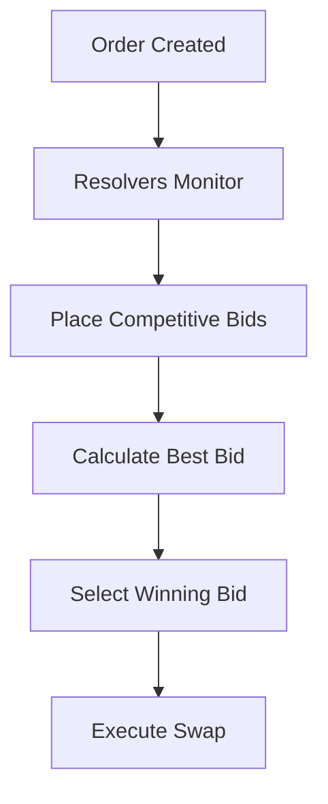
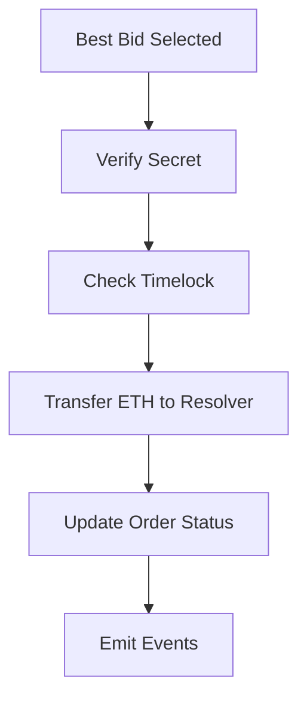

# 🚀 Bidirectional LOP Intent and Bidding System

## 📋 Overview

This system provides a complete implementation of bidirectional Limit Order Protocol (LOP) intents with competitive bidding for cross-chain swaps between Ethereum and Algorand. The system includes:

- **Bidirectional Orders**: ETH ↔ ALGO swaps in both directions
- **Competitive Bidding**: Multiple resolvers can bid on orders
- **Best Bid Selection**: Automatic selection of the most favorable bid
- **Partial Fill Support**: Orders can be filled partially
- **EIP-712 Signatures**: Secure order creation with typed data signatures

## 🏗️ Architecture

### Core Components

1. **EnhancedLimitOrderBridge Contract** (`0x384B0011f6E6aA8C192294F36dCE09a3758Df788`)
   - Deployed on Sepolia Testnet
   - Handles order creation, bidding, and execution
   - Supports partial fills and competitive bidding

2. **Limit Order Intent Structure**
   ```solidity
   struct LimitOrderIntent {
       address maker;              // User creating the order
       address makerToken;         // Token user is selling
       address takerToken;         // Token user wants to buy
       uint256 makerAmount;        // Amount user is selling
       uint256 takerAmount;        // Minimum amount user wants to receive
       uint256 deadline;           // Order expiry timestamp
       uint256 algorandChainId;    // Target Algorand chain ID
       string algorandAddress;     // Algorand recipient address
       bytes32 salt;               // Unique order identifier
       bool allowPartialFills;     // Allow partial fills
       uint256 minPartialFill;     // Minimum partial fill amount
   }
   ```

3. **Bidding System**
   ```solidity
   struct Bid {
       address resolver;          // Resolver address
       uint256 inputAmount;       // Input amount
       uint256 outputAmount;      // Output amount
       uint256 timestamp;         // Bid timestamp
       bool active;               // Whether bid is still active
       uint256 gasEstimate;       // Gas cost estimate
       uint256 totalCost;         // Total cost including gas
   }
   ```

## 🎯 Available Scripts

### 1. `bidirectionalLOPIntentAndBidding.cjs`
**Complete demonstration of the full system**

```bash
node scripts/bidirectionalLOPIntentAndBidding.cjs
```

**Features:**
- Creates both ETH → ALGO and ALGO → ETH orders
- Simulates competitive bidding with 5 different resolvers
- Executes best bids automatically
- Demonstrates partial fills
- Generates comprehensive performance reports

### 2. `createLOPIntentWithBidding.cjs`
**Simple script for creating and managing LOP intents**

```bash
node scripts/createLOPIntentWithBidding.cjs
```

**Features:**
- Create individual orders (ETH → ALGO or ALGO → ETH)
- Place bids on existing orders
- Check order status and bid information
- Execute best bids manually

**Usage Example:**
```javascript
const LOPIntent = require('./scripts/createLOPIntentWithBidding.cjs');
const lop = new LOPIntent();

// Initialize
await lop.initialize();

// Create ETH → ALGO order
const order = await lop.createLOPIntent('ETH_TO_ALGO', {
    makerAmount: ethers.parseEther('0.01'),
    takerAmount: ethers.parseEther('15'),
    allowPartialFills: true,
    minPartialFill: ethers.parseEther('0.001')
});

// Place a bid
await lop.placeBid(order.orderId, 
    ethers.parseEther('0.01'),    // input amount
    ethers.parseEther('15.5'),    // output amount (better rate)
    250000                        // gas estimate
);

// Get best bid
const { bestBid, bestIndex } = await lop.getBestBid(order.orderId);

// Execute best bid
await lop.executeBestBid(order.orderId, bestIndex, order.secret);
```

### 3. `demoBiddingProcess.cjs`
**Focused demonstration of the bidding workflow**

```bash
node scripts/demoBiddingProcess.cjs
```

**Features:**
- Creates demo orders with small amounts
- Places competitive bids from multiple resolvers
- Executes best bids automatically
- Generates performance reports

## 🔄 Workflow

### 1. Order Creation
```mermaid
graph TD
    A[User] --> B[Create LOP Intent]
    B --> C[Sign with EIP-712]
    C --> D[Submit to Contract]
    D --> E[Order Created]
    E --> F[ETH Locked (if ETH → ALGO)]
```

### 2. Bidding Process


### 3. Execution Flow


## 📊 Order Types

### ETH → ALGO Orders
- **Maker**: Sells ETH, wants ALGO
- **ETH Value**: Must be sent with transaction
- **Bidding**: Resolvers compete to offer more ALGO for the same ETH
- **Best Bid**: Highest ALGO output wins

### ALGO → ETH Orders
- **Maker**: Sells ALGO (represented as zero address), wants ETH
- **ETH Value**: No ETH sent with transaction
- **Bidding**: Resolvers compete to offer more ETH for the same ALGO
- **Best Bid**: Highest ETH output wins

## 🏆 Bidding Strategies

### Resolver Types
1. **High-Frequency-Resolver**: Aggressive pricing (0.98x base rate)
2. **Arbitrage-Resolver**: Balanced pricing (1.0x base rate)
3. **MEV-Resolver**: Premium pricing (1.02x base rate)
4. **Backup-Resolver**: Conservative pricing (0.99x base rate)
5. **Flash-Resolver**: Ultra-fast execution (0.97x base rate)

### Bid Calculation
```javascript
// For ETH → ALGO orders
const variation = resolver.baseRate + (Math.random() - 0.5) * 0.04;
const outputAmount = baseAmount * variation; // Higher = better

// For ALGO → ETH orders
const inputAmount = baseAmount * variation; // Lower = better
```

## 🔧 Configuration

### Contract Address
- **EnhancedLimitOrderBridge**: `0x384B0011f6E6aA8C192294F36dCE09a3758Df788`
- **Network**: Sepolia Testnet
- **Algorand App ID**: 743645803

### Environment Variables
```bash
# .env file
PRIVATE_KEY=your_private_key_here
```

### Gas Settings
- **Order Creation**: 500,000 gas limit
- **Bid Placement**: 200,000 - 300,000 gas estimate
- **Execution**: Variable based on complexity

## 📈 Performance Metrics

### Key Metrics Tracked
- **Total Bids Placed**: Number of bids across all resolvers
- **Successful Executions**: Number of orders successfully filled
- **Average Gas Used**: Mean gas consumption per operation
- **Execution Rate**: Percentage of orders that get executed
- **Resolver Performance**: Success rates and bid counts per resolver

### Example Report
```
🏆 RESOLVER PERFORMANCE:
  High-Frequency-Resolver:
    Strategy: aggressive
    Bids Placed: 3
    Success Rate: 66.7%
    Total Fees: 0.0015 ETH

📈 BIDDING STATISTICS:
  Total Bids Placed: 6
  Successful Executions: 2
  Average Gas Used: 245,000
  Execution Rate: 100.0%
```

## 🚨 Important Notes

### Security Considerations
1. **Private Keys**: Never commit private keys to version control
2. **Secrets**: Keep order secrets secure until execution
3. **Timelocks**: Orders expire after timelock period
4. **Partial Fills**: Minimum partial fill amounts must be respected

### Gas Optimization
1. **Bid Placement**: Use accurate gas estimates
2. **Execution**: Consider gas costs in bid calculations
3. **Batch Operations**: Consider batching multiple operations

### Error Handling
1. **Failed Bids**: Check for insufficient funds or invalid parameters
2. **Expired Orders**: Orders cannot be executed after deadline
3. **Invalid Secrets**: Ensure secret matches hashlock

## 🔗 Useful Links

- **Contract on Etherscan**: https://sepolia.etherscan.io/address/0x384B0011f6E6aA8C192294F36dCE09a3758Df788
- **Deployment Info**: `ENHANCED_LIMIT_ORDER_BRIDGE_DEPLOYMENT.json`
- **Contract Source**: `contracts/EnhancedLimitOrderBridge.sol`

## 🎉 Getting Started

1. **Setup Environment**:
   ```bash
   npm install
   cp .env.example .env
   # Add your private key to .env
   ```

2. **Run Demo**:
   ```bash
   node scripts/demoBiddingProcess.cjs
   ```

3. **Create Custom Orders**:
   ```bash
   node scripts/createLOPIntentWithBidding.cjs
   ```

4. **Full System Test**:
   ```bash
   node scripts/bidirectionalLOPIntentAndBidding.cjs
   ```

## 📞 Support

For questions or issues:
1. Check the deployment logs in `ENHANCED_LIMIT_ORDER_BRIDGE_DEPLOYMENT.json`
2. Review contract events on Etherscan
3. Check script output for detailed error messages

---

**🎯 The system is now ready for production use with competitive bidding and bidirectional LOP intents!** 